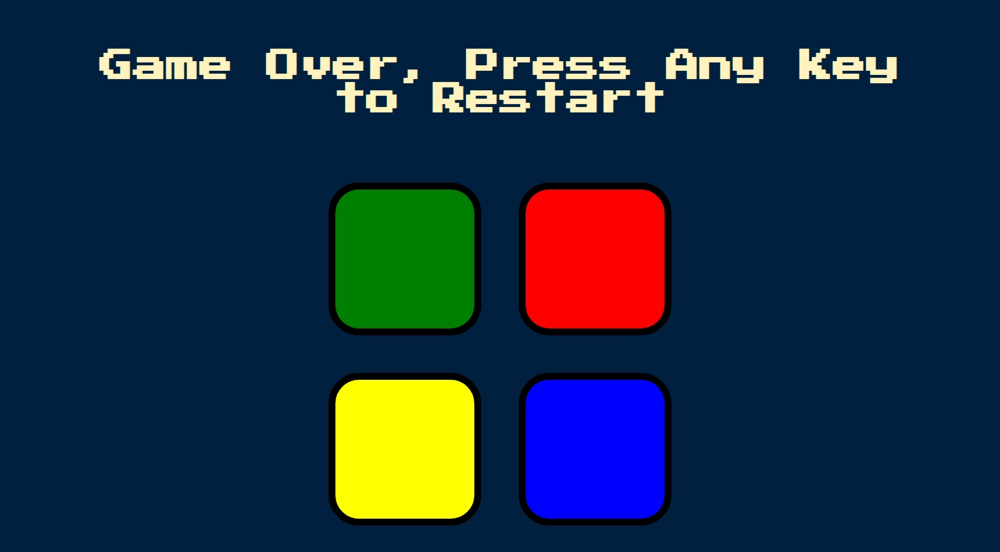

## Table of contents

- [Overview](#overview)
  - [The challenge](#the-challenge)
  - [Screenshot](#screenshot)
  - [Links](#links)
- [Built with](#built-with)
- [Author](#author)

## Overview

This is a copy cat of the popular simon game which is used to test how long/well we store patterns in our memory.

### The challenge

Users should be able to:

- View the optimal layout depending on their device's screen size
- Press any key to START the game. The Computer will give the first signal. You the user will Repeat the signal by pressing the same color lens.

- The Computer will duplicate the first signal and add one. Repeat these two signals by pressing the same color lenses, in order.

- The Computer will duplicate these first two signals and add one.

- Continue playing as long as you can repeat each sequence of signals correctly.

- If you fail to repeat a sequence exactly, The Computer responds with a "RAZZ" sound and a Red flash. This means you've lost, and the game is over but you can also press any key again to start over.

### Screenshot

### Links

- Solution URL: [Solution URL here](https://github.com/boomshakar/simon-game)
- Live Site URL: [Live site URL here](https://boom-simongame.netlify.app/)
- Live Site URL: [Live site URL here](https://boomshakar.github.io/simon-game/)

### Built with

- Semantic HTML5 markup
- JavaScript
- CSS

## Author

- Website - [Oluwafemi Sosanya](https://boomshakar.netlify.app/contact.html)
- Twitter - [@_boomshakar_](https://www.twitter.com/_boomshakar)
